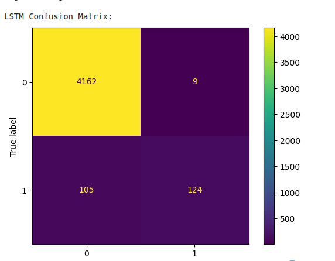
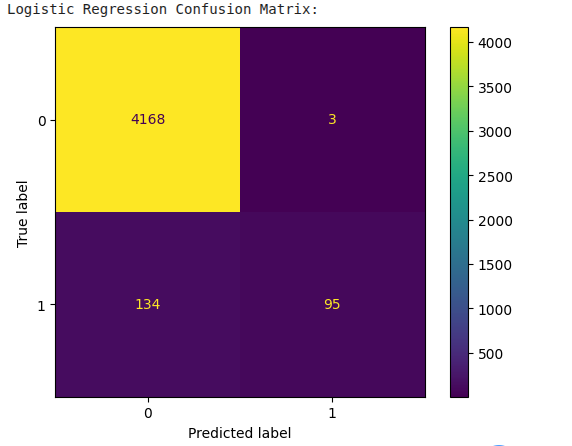
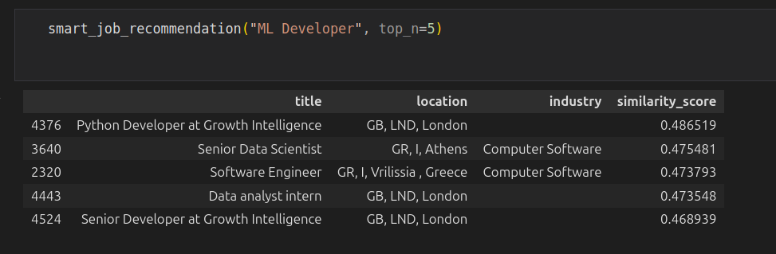
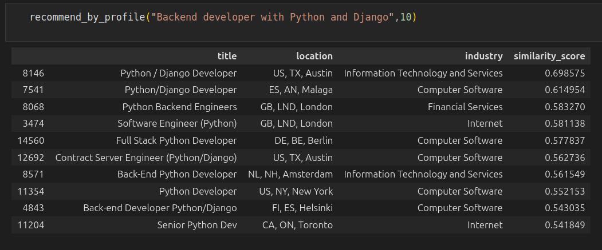

# 🚨 Job Fraud Detection using Machine Learning & Deep Learning

## 📌 Project Overview
This project focuses on the **automatic detection of fraudulent job postings**
using **Machine Learning and Deep Learning techniques**.
The objective is to help identify scam job offers by analyzing textual job
descriptions with Natural Language Processing (NLP) methods.

---

## 🎯 Objectives
- Detect fraudulent job offers based on textual content
- Compare classical Machine Learning models with Deep Learning approaches
- Evaluate model performance using standard classification metrics

---

## 🧠 Methods & Models
The project explores multiple approaches:

### 🔹 Machine Learning
- TF-IDF for text vectorization
- Logistic Regression for classification

### 🔹 Deep Learning
- LSTM-based neural network for sequence modeling
- Word embeddings for semantic representation

---

## 🔧 Technologies Used
- Python
- Pandas, NumPy
- Scikit-learn
- TensorFlow / Keras
- NLP (TF-IDF, embeddings)
- Jupyter Notebook

---

## 📊 Dataset & Preprocessing
- Text cleaning and normalization
- Tokenization and vectorization
- Train / validation split
- Handling class imbalance (if applicable)

---

## 📈 Evaluation Metrics
- Accuracy
- Precision, Recall, F1-score
- Confusion Matrix

## 📊 Dataset Visualization

### WordCloud of Job Descriptions

---

## 🧠 Model Evaluation

### LSTM Confusion Matrix

### Logistic Regression Confusion Matrix

---

## 🤝 Job Recommendation System

### Smart Job Recommendation

### Recommend by Profile

